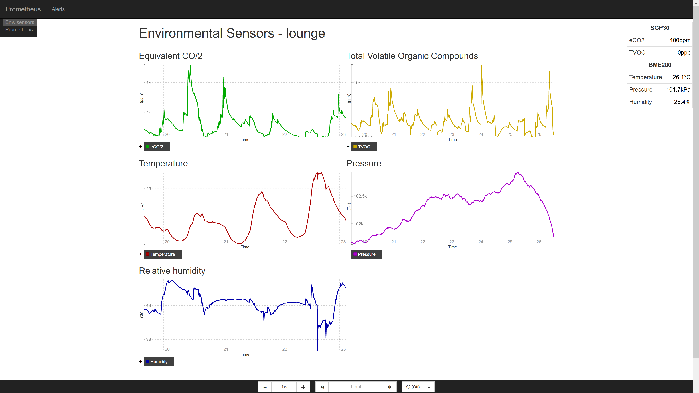

# Prometheus Enviro Sensors

## About

This is a small python daemon (and some sample configuration) that plumbs some environment sensor modules that are suitable for use with a Raspberry Pi to the Prometheus monitoring system, which can log and graph the data.

There's also a script you can run that will display some current values and trend direction on a compatible tiny screen.

This is absolutely a quick hack, to set expectations. But I did document it, so it's got that going for it.

### Screenshots

This is the Prometheus console provided by the default configuration:

You can edit that console template to your choosing, or write a different one, or even go do it via [Grafana](https://prometheus.io/docs/visualization/grafana/):

A Pimoroni breakout garden with the right modules plugged in can cycle through some values locally:

### Supported sensors

- [SGP30](https://shop.pimoroni.com/products/sgp30-air-quality-sensor-breakout) air quality sensor (eCO/2, TVOC)
  - This one is useful over the other "air quality" sensors because it actually gives calibrated CO/2 readings, even if "equivalent", rather than an arbitrary "quality" scale.
- [BME280](https://shop.pimoroni.com/products/bme280-breakout) (temperature, pressure, humidity)

Note that it does *not* currently support all the sensors in the Pimoroni [Enviro](https://shop.pimoroni.com/products/enviro) HAT, just the BME280, although it should be easy enough to add (the name is perhaps a little aspirational). I just don't have the hardware to test (or, thus, much inclination). I would suspect that having both this and the code running the display read the sensors at the same time would work poorly, though. If you have the actual hat, it may be easier to hack *that* to export to Prometheus, than hack *this* to co-exist.

If you want to use the modules above, it's probably easier to plug them into Pimoroni's [breakout garden](https://shop.pimoroni.com/products/breakout-garden-hat-i2c-spi) (there are versions for most Pi variants now). Then everything just plugs together, which is nice.

If you have both the SGP30 and the BME280, the daemon will use the latter to provide humidity compensation data for the former; see [section 3.16 of the driver integration guide](https://www.sensirion.com/fileadmin/user_upload/customers/sensirion/Dokumente/9_Gas_Sensors/Sensirion_Gas_Sensors_SGP30_Driver-Integration-Guide_SW_I2C.pdf).

### Local display panel

The [1.3" SPI color LCD](https://shop.pimoroni.com/products/1-3-spi-colour-lcd-240x240-breakout) is what it's written for, but it should work with anything supported by the ST7789 library. There is *not* support for arbitrary framebuffer devices or anything (but it probably just requires telling PIL to render somewhere else).

## Setup

**See [doc/setup-logging.md](doc/setup-logging.md).**

If you have the display as well, then see **[doc/setup-display.md](doc/setup-display.md)**.

## TODO

There is absolutely no guarantee I'll ever get to any of this. It's an idea dumping ground. Pull requests welcome though.

- Support more of the environmental sensors, like the relevant EnviroHat ones.
  - [LTR-559](https://shop.pimoroni.com/products/ltr-559-light-proximity-sensor-breakout) (light, proximity)
  - [MICS6814](https://shop.pimoroni.com/products/mics6814-gas-sensor-breakout) (CO, NO2, NH3)
- Allow using the CPU temperature compensation logic that's in the examples for the BME280, for setups that have the board mounted directly over it. (I use a short GPIO ribbon cable.)
- For that matter, implement `vcgencmd measure_temp` as an optional sensor, so it can be compensated for Prometheus-side with a computed metric if desired.
- Bother to set up the Prometheus console to support multiple instances.
- Suggest some Prometheus alerts, like high CO/2 concentrations.
- Consider doing some refactoring for sensors as a collection of instances of a subclass with register_metrics/init_sensor/measure methods, but this is a little tricksy due to the SGP30/BME280 interaction. Later, if/when there are more supported, perhaps.
- There's no systemd service setup for the display script yet.

Bugs/nits:

- The stderr messages *should* be going into the journal that `systemctl status` shows snippets from, but seem to be getting lost. This doesn't really matter since it's just startup messages.
- The polling isn't really every second; that's a lower-bound assuming everything else is instant, but there are known `sleep`s in the sensor libraries.
- The SGP30 baseline is not saved on graceful exit. This probably doesn't matter much since I don't think it's supposed to drift dramatically, so long as you're running the daemon for at least an hour.

Really scope-creepy stuff:

- Log to rrdtool as well, for more suitable long-term storage with downsampling.
- Have a different display script that only shows Prometheus alerts on the tiny panel. For example, have an alert suggest an image and a priority as labels, and if there are any, show the highest one and the metric value, else keep the screen backlight off.

## Thanks

[Posters on the Adafruit forums](https://forums.adafruit.com/viewtopic.php?f=19&t=133097#p661509), for pointing out the SGP30 really wants its baseline value saved and restored when monitoring is interrupted, otherwise it takes up to 12 hours to recover properly. The example code doesn't do this, but [the library has the methods for it](https://github.com/pimoroni/sgp30-python/blob/master/library/sgp30/__init__.py#L165). This used to be really visible as readings plummeting down to minimums on a daemon restart.

## License

Licensed under the [EUPL-1.2-or-later](https://joinup.ec.europa.eu/collection/eupl/eupl-text-eupl-12).
(See [GitHub's summary of its terms](https://choosealicense.com/licenses/eupl-1.2/) if unfamiliar. It's a strong copyleft open source license like the Affero GPL.)
